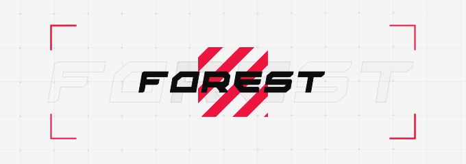

  

  Network & System Enthusiast - Building, Breaking, and Optimizing Systems.

  
  

## About Me

Focused on networking and infrastructure, with hands-on experience in building and managing systems.  
Interested in automation, self-hosted environments, and efficient system design.

- 🎓 Informatics Student at **Universitas Pamulang**
- 📡 Interested in Networking & System
- ⚡ Hands-on learner

---

### 📂 Featured Project

- Self-hosted server (Docker + Nginx + Cloudflare)

---

### 🚀 Last Project

- 🔧 Network lab setup (Mikrotik)
- 🌐 Homelab Automation server configuration (Ubuntu 26.04 LTS)
- 🤖 Simple automation AI Server with n8n + Gemini API

---

### 🖥️ Operating System

  
  
  

---

### 🛠️ Tools And Tech

#### Service

  
  
  
  

#### Network Infrastructure

  
  
  

#### Cloud & Virtualization

  
  
  
  
  

#### Automation

  

---

### 🌐 Languages

  
  
  
  
  
  
  

#### IDE

  
  
  
  

---

### 🤖 AI Tools

  <i>"AI is just a tool, it's up to you how you use it."</i>

---

  

