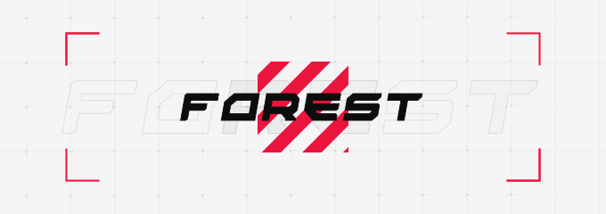

  

  
  

- 🎓 Student at [**Universitas Pamulang**](https://unpam.ac.id)
- 🧑‍💻 Junior Dev's
- 📡 Network Engineer
- 🎬 Video Editor
- 🧑‍💻 Experienced in Python, Networking, Video Editing 

---

<h3 align="left"> 🛠️ OSes Used </h3>

 
  
  

<h3 align="left"> 🛠️ Tools And Other </h3>

  
  
  
  
  
  
  
  
  
  
  

---

